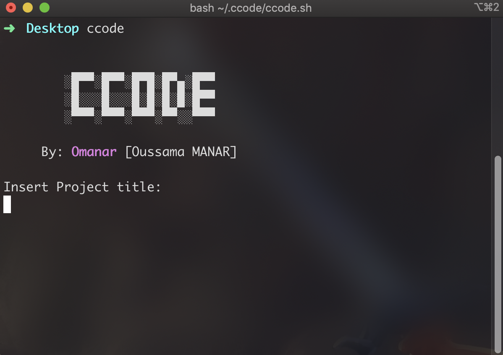

<!-------------------------------------------------
|      ____  ____ ___  ____ _____  ____ ______    |
|     / __ \/ __ `__ \/ __ `/ __ \/ __ `/ ___/    |
|    / /_/ / / / / / / /_/ / / / / /_/ / /        |
|    \____/_/ /_/ /_/\__,_/_/ /_/\__,_/_/         |
|                                                 |
|    README.md                                    |
|    By: omanar <manarsama01@gmail.com>           |
|    Created: 2022/08/29 07:30 PM by omanar       |
|                                                 |
-------------------------------------------------->

# Ccode

Ccode is a program that makes you create a simple C language project environment using one command

# How to install ?

Clone the project

```bash
  git clone https://github.com/omanar42/ccode.git
```

Go to the project directory

```bash
  cd ccode
```

Give permission

```bash
  chmod +x installer.sh
```

Run the installer

```bash
  bash installer.sh
```

# How to use ?

Run the command after installing it

```bash
  ccode
```
If you want to use it without installing, give permission and run.

```bash
  bash ccode.sh
```

## Screenshots



# Notes :

In case of any error/issue, please don't hesitate to report it.

- [@omanar42](https://www.github.com/omanar42)
